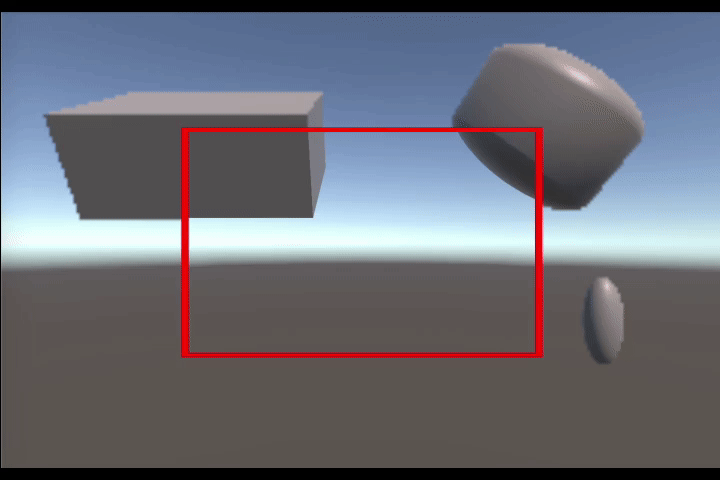

# QuadFR
Это попытка реализовать подход TwoPasses через дву камеры. Одна имеет широкий угол обзора и рендерит изображение на текстуру с низкой плотностью пикселей. Другая - рендерит только часть изображение, имеет узкий угол обзора и рендерит на текстуру с высокой плотностью пикселей.

Однако реальность сурова, и совместить две камеры с разным Field Of View невозможно. Можно попробовать деформировать маленький прямоугольник в зависимости от его положения (например, как в Adobe Scan), а потом пытаться наложить его на большой прямоугольник. Но кажется легче уже будет писать нативный плагин по аналогии с VRSBased (нужно использовать что-то типа scissor test, но чтобы он происходил на этапе растеризации или раньше).

